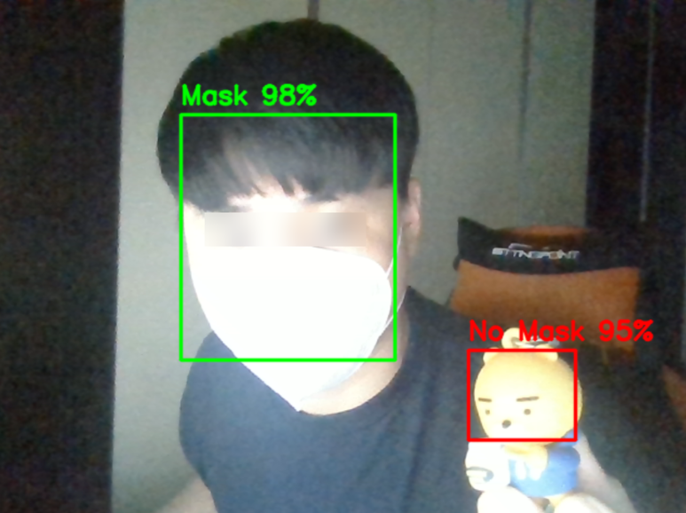

# COVID-19 Face Mask Detection

Face and mask detection using CNN

## Requirement

- TensorFlow 2+
- OpenCV
- numpy
- matplotlib

## Reference

- Dataset: https://github.com/prajnasb/observations
- Code: https://www.pyimagesearch.com/2020/05/04/covid-19-face-mask-detector-with-opencv-keras-tensorflow-and-deep-learning/
- Code2 : https://github.com/kairess/mask-detection#covid-19-face-mask-detection
