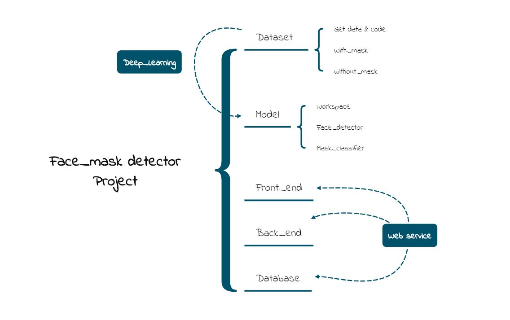
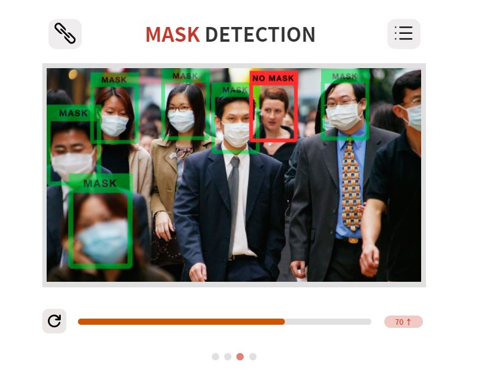

# SideProj.-Mask_Detection
 210430 ~ 사이드 프로젝트 with GPR, YWS ~ 210610
 
- 프로젝트 순서

- UML 
- 예상되는 결과물 

## Check Point
- [ ] 본인이 진행해 본 프로젝트를 떠올리며 몇 개에 해당하는지 체크해봅시다.   
- [ ] 실제 서비스를 공개적으로 배포하고 운영해보는 경험을 해 보았다   
- [ ] 유저의 피드백에 따라 성능/사용성을 개선하고 신규 기능을 추가해보았다   
- [ ]  발견되는 버그와 개선사항을 정리하고 쌓인 이슈들을 체계적으로 관리 해 보았다   
- [ ] 코드를 지속적으로 리펙토링하고 디자인패턴을 적용 해 보았다   
- [ ] 위의 시도에서 더 좋은 설계와 더 빠른 개발 사이의 트레이드오프를 고민을 해보았다   
- [ ] 반복되는 수정과 배포에 수반되는 작업들을 자동화해보았다   
- [x] 언어나 프레임워크의 기능만으로 구현 할 수없는 것들을 직접 구현해보았다   
- [ ] 내가 사용한 라이브러리나 프레임워크의 문제점이나 한계를 느끼고 개선해보았다   
- [ ] 코드나 제품의 퀄리티를 유지하기 위한 분석툴이나 테스트툴을 도입해보았다   
- [x] 타인과의 협업을 효율적으로 하기위한 고민을 해보았다   

## Generate Data
데이터 수집을 위한 여러 가지 방법
### How to Create
1. 마스크를 착용한 이미지 데이터 수집
2. 인물 데이터에 마스크 합성
3. 인물 데이터에 마스크 효과 처리
    - 2번과 3번으로 자체적인 데이터 생성
    - [How to Create](./dataset/code/)

## Model
### Face detector
### Mask Classifier
