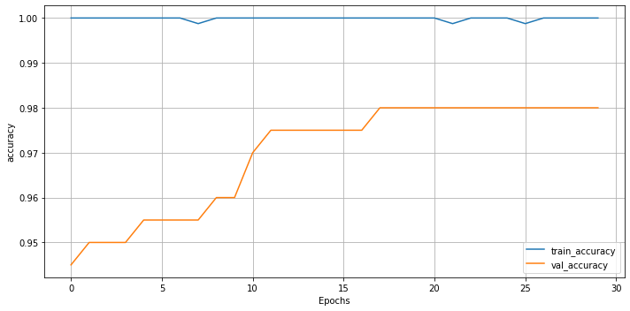

```python
!nvidia-smi
```

    Sun May 23 04:53:18 2021       
    +-----------------------------------------------------------------------------+
    | NVIDIA-SMI 465.19.01    Driver Version: 460.32.03    CUDA Version: 11.2     |
    |-------------------------------+----------------------+----------------------+
    | GPU  Name        Persistence-M| Bus-Id        Disp.A | Volatile Uncorr. ECC |
    | Fan  Temp  Perf  Pwr:Usage/Cap|         Memory-Usage | GPU-Util  Compute M. |
    |                               |                      |               MIG M. |
    |===============================+======================+======================|
    |   0  Tesla T4            Off  | 00000000:00:04.0 Off |                    0 |
    | N/A   32C    P8     9W /  70W |      0MiB / 15109MiB |      0%      Default |
    |                               |                      |                  N/A |
    +-------------------------------+----------------------+----------------------+
                                                                                   
    +-----------------------------------------------------------------------------+
    | Processes:                                                                  |
    |  GPU   GI   CI        PID   Type   Process name                  GPU Memory |
    |        ID   ID                                                   Usage      |
    |=============================================================================|
    |  No running processes found                                                 |
    +-----------------------------------------------------------------------------+
    


```python
import os
import numpy as np
import random
```


```python
%pwd
```


    '/content'


```python
# 작업 경로로 이동
%cd /content/drive/MyDrive/mask_detector
```

    /content/drive/MyDrive/mask_detector
    

# train, test dataset 나누기


```python
# path 변수 생성
base_path = '/content/drive/MyDrive/mask_detector'
image_path = os.path.join(base_path, 'images')
model_path = os.path.join(base_path, 'models')

 # directory 경로
train_path = os.path.join(image_path, 'train')
validation_path = os.path.join(image_path, 'validation')
test_path = os.path.join(image_path, 'test')
```


```python
image_path
```


    '/content/drive/MyDrive/mask_detector/images'


```python
# 이미지 압축 풀기
!unzip -q without_mask600.zip -d /content/drive/MyDrive/mask_detector/images
!unzip -q with_mask600.zip -d /content/drive/MyDrive/mask_detector/images
```


```python
import random
import shutil

def split_move_image(data_path):
    # 필요한 directory 생성
    os.makedirs(os.path.join(image_path, 'train', 'with_mask'), exist_ok=True)
    os.makedirs(os.path.join(image_path, 'train', 'without_mask'), exist_ok=True)
    os.makedirs(os.path.join(image_path, 'validation', 'with_mask'), exist_ok=True)
    os.makedirs(os.path.join(image_path, 'validation', 'without_mask'), exist_ok=True)
    os.makedirs(os.path.join(image_path, 'test', 'with_mask'), exist_ok=True)
    os.makedirs(os.path.join(image_path, 'test', 'without_mask'), exist_ok=True)

    image_list = [fname for fname in os.listdir(data_path) if os.path.splitext(fname)[-1] == '.jpg']
    random.shuffle(image_list)

    img = image_list[0]
    classes = 'without_mask'
    if img.split('_')[0] == 'with':
        classes = 'with_mask'
    
    for i, image in enumerate(image_list):
        if i < 400:
            shutil.move(os.path.join(image_path, image), os.path.join(train_path, classes, image))
        elif i < 500:
            shutil.move(os.path.join(image_path, image), os.path.join(validation_path, classes, image))
        else:
            shutil.move(os.path.join(image_path, image), os.path.join(test_path, classes, image))
```


```python
split_move_image(image_path, train_path, test_path, validation_path)
```

## pretrained model 불러와서 fine tuning

1. generator 생성
2. 모델 생성 및 컴파일
3. callback(modelcheckpoint) 정의, best model 경로 지정
4. 학습하기
5. history 시각화
6. evaluate


```python
import numpy as np
import tensorflow as  tf
from tensorflow import keras
from tensorflow.keras import layers
from tensorflow.keras.applications import MobileNetV2
from tensorflow.keras.preprocessing.image import ImageDataGenerator
```

#### 1. generator 생성


```python
N_BATCHS = 100
N_EPOCHS = 100
LEANRING_RATE = 0.001

def get_generators():
    train_datagen = ImageDataGenerator(rescale=1/255,
                                       rotation_range=40,
                                       brightness_range=(0.7, 1.3),
                                       zoom_range=0.2,
                                       horizontal_flip=True)
    test_datagen = ImageDataGenerator(rescale=1/255) 
    # generator 생성
    train_generator = train_datagen.flow_from_directory(train_path,
                                                        target_size=(224, 224),
                                                        batch_size=N_BATCHS,
                                                        class_mode='binary')
    validation_generator = test_datagen.flow_from_directory(validation_path,
                                                            target_size=(224, 224),
                                                            batch_size=N_BATCHS,
                                                            class_mode='binary')
    test_generator = test_datagen.flow_from_directory(test_path,
                                                      target_size=(224, 224),
                                                      batch_size=N_BATCHS,
                                                      class_mode='binary')
    return train_generator, validation_generator, test_generator
```

#### 2. 모델 생성 및 컴파일


```python
# basemodel = MobileNetV2(include_top=False, weights='imagenet', input_tensor=keras.Input(shape=(224, 224, 3)))
# headmodel = basemodel.output
# headmodel = layers.GlobalAveragePooling2D()(headmodel)
# headmodel = layers.Dense(128)(headmodel)
# headmodel = layers.BatchNormalization()(headmodel)
# headmodel = layers.ReLU()(headmodel)
# headmodel = layers.Dropout(rate=0.5)(headmodel)
# headmodel = layers.Dense(2, activation='softmax')(headmodel)

# model = Model(inputs=basemodel.input, outputs=headmodel)
```


```python
basemodel = MobileNetV2(include_top=False, weights='imagenet', input_shape=(224, 224, 3))

model = keras.Sequential()
model.add(basemodel)
model.add(layers.GlobalAveragePooling2D())
model.add(layers.Dense(128))
model.add(layers.BatchNormalization())
model.add(layers.ReLU())
model.add(layers.Dropout(rate=0.5))

model.add(layers.Dense(1, activation='sigmoid'))
```


```python
model.compile(optimizer=keras.optimizers.Adam(learning_rate=LEANRING_RATE),
              loss='binary_crossentropy', metrics=['accuracy'],)
```


```python
model.summary()
```

    Model: "sequential_2"
    _________________________________________________________________
    Layer (type)                 Output Shape              Param #   
    =================================================================
    mobilenetv2_1.00_224 (Functi (None, 7, 7, 1280)        2257984   
    _________________________________________________________________
    global_average_pooling2d_2 ( (None, 1280)              0         
    _________________________________________________________________
    dense_4 (Dense)              (None, 128)               163968    
    _________________________________________________________________
    batch_normalization_2 (Batch (None, 128)               512       
    _________________________________________________________________
    re_lu_2 (ReLU)               (None, 128)               0         
    _________________________________________________________________
    dropout_2 (Dropout)          (None, 128)               0         
    _________________________________________________________________
    dense_5 (Dense)              (None, 1)                 129       
    =================================================================
    Total params: 2,422,593
    Trainable params: 2,388,225
    Non-trainable params: 34,368
    _________________________________________________________________
    


```python
train_iterator, validation_iterator, test_iterator = get_generators()
```

    Found 800 images belonging to 2 classes.
    Found 200 images belonging to 2 classes.
    Found 207 images belonging to 2 classes.
    

#### 3. callback 정의 및 최종 모델 저장할 경로 지정


```python
saved_model_path = os.path.join(model_path, 'saved_model_{epoch:02d}.ckpt')
```


```python
# callback 정의
mc_callback = keras.callbacks.ModelCheckpoint(saved_model_path,
                                              verbose=1,
                                              monitor='val_loss',
                                              save_best_only=True,)

# rlp_callback = keras.callbacks.ReduceLROnPlateau(monitor='val_loss', factor=0.3,
#                                                 patience=4, verbose=1)
```

#### 4. 학습


```python
history = model.fit(train_iterator,
                    epochs=N_EPOCHS,
                    steps_per_epoch=len(train_iterator),
                    validation_data=validation_iterator,
                    validation_steps=len(validation_iterator),
                    callbacks=[mc_callback])
```

    Epoch 1/100
    8/8 [==============================] - 23s 2s/step - loss: 0.4285 - accuracy: 0.7725 - val_loss: 0.0168 - val_accuracy: 0.9900
    
    Epoch 00001: val_loss improved from inf to 0.01683, saving model to /content/drive/MyDrive/mask_detector/models/saved_model_01.ckpt
    INFO:tensorflow:Assets written to: /content/drive/MyDrive/mask_detector/models/saved_model_01.ckpt/assets
    Epoch 2/100
    8/8 [==============================] - 17s 2s/step - loss: 0.0267 - accuracy: 0.9924 - val_loss: 0.0089 - val_accuracy: 0.9950
    
    Epoch 00002: val_loss improved from 0.01683 to 0.00888, saving model to /content/drive/MyDrive/mask_detector/models/saved_model_02.ckpt
    INFO:tensorflow:Assets written to: /content/drive/MyDrive/mask_detector/models/saved_model_02.ckpt/assets
    Epoch 3/100
    8/8 [==============================] - 17s 2s/step - loss: 0.0109 - accuracy: 1.0000 - val_loss: 0.0443 - val_accuracy: 0.9800
    
    Epoch 00003: val_loss did not improve from 0.00888
    Epoch 4/100
    8/8 [==============================] - 17s 2s/step - loss: 0.0073 - accuracy: 0.9996 - val_loss: 0.0542 - val_accuracy: 0.9850
    
    Epoch 00004: val_loss did not improve from 0.00888
    Epoch 5/100
    8/8 [==============================] - 17s 2s/step - loss: 0.0086 - accuracy: 0.9991 - val_loss: 0.1680 - val_accuracy: 0.9650
    
    Epoch 00005: val_loss did not improve from 0.00888
    Epoch 6/100
    8/8 [==============================] - 17s 2s/step - loss: 0.0095 - accuracy: 0.9974 - val_loss: 0.1179 - val_accuracy: 0.9750
    
    Epoch 00006: val_loss did not improve from 0.00888
    Epoch 7/100
    8/8 [==============================] - 17s 2s/step - loss: 0.0089 - accuracy: 0.9985 - val_loss: 0.0029 - val_accuracy: 1.0000
    
    Epoch 00007: val_loss improved from 0.00888 to 0.00291, saving model to /content/drive/MyDrive/mask_detector/models/saved_model_07.ckpt
    INFO:tensorflow:Assets written to: /content/drive/MyDrive/mask_detector/models/saved_model_07.ckpt/assets
    Epoch 8/100
    8/8 [==============================] - 17s 2s/step - loss: 0.0059 - accuracy: 1.0000 - val_loss: 0.0029 - val_accuracy: 1.0000
    
    Epoch 00008: val_loss improved from 0.00291 to 0.00291, saving model to /content/drive/MyDrive/mask_detector/models/saved_model_08.ckpt
    INFO:tensorflow:Assets written to: /content/drive/MyDrive/mask_detector/models/saved_model_08.ckpt/assets
    Epoch 9/100
    8/8 [==============================] - 17s 2s/step - loss: 0.0052 - accuracy: 0.9996 - val_loss: 0.0029 - val_accuracy: 1.0000
    
    Epoch 00009: val_loss improved from 0.00291 to 0.00287, saving model to /content/drive/MyDrive/mask_detector/models/saved_model_09.ckpt
    INFO:tensorflow:Assets written to: /content/drive/MyDrive/mask_detector/models/saved_model_09.ckpt/assets
    Epoch 10/100
    8/8 [==============================] - 17s 2s/step - loss: 0.0077 - accuracy: 0.9986 - val_loss: 0.1192 - val_accuracy: 0.9750
    
    Epoch 00010: val_loss did not improve from 0.00287
    Epoch 11/100
    8/8 [==============================] - 17s 2s/step - loss: 0.0254 - accuracy: 0.9916 - val_loss: 0.0363 - val_accuracy: 0.9900
    
    Epoch 00011: val_loss did not improve from 0.00287
    Epoch 12/100
    8/8 [==============================] - 17s 2s/step - loss: 0.0292 - accuracy: 0.9948 - val_loss: 1.5647 - val_accuracy: 0.7700
    
    Epoch 00012: val_loss did not improve from 0.00287
    Epoch 13/100
    8/8 [==============================] - 17s 2s/step - loss: 0.0256 - accuracy: 0.9873 - val_loss: 0.0876 - val_accuracy: 0.9650
    
    Epoch 00013: val_loss did not improve from 0.00287
    Epoch 14/100
    8/8 [==============================] - 17s 2s/step - loss: 0.0107 - accuracy: 0.9977 - val_loss: 0.4158 - val_accuracy: 0.8450
    
    Epoch 00014: val_loss did not improve from 0.00287
    Epoch 15/100
    8/8 [==============================] - 17s 2s/step - loss: 0.0106 - accuracy: 0.9984 - val_loss: 0.2236 - val_accuracy: 0.9450
    
    Epoch 00015: val_loss did not improve from 0.00287
    Epoch 16/100
    8/8 [==============================] - 17s 2s/step - loss: 0.0042 - accuracy: 0.9987 - val_loss: 1.3314 - val_accuracy: 0.7600
    
    Epoch 00016: val_loss did not improve from 0.00287
    Epoch 17/100
    8/8 [==============================] - 17s 2s/step - loss: 0.0039 - accuracy: 0.9989 - val_loss: 0.9973 - val_accuracy: 0.8300
    
    Epoch 00017: val_loss did not improve from 0.00287
    Epoch 18/100
    8/8 [==============================] - 17s 2s/step - loss: 0.0047 - accuracy: 1.0000 - val_loss: 0.5338 - val_accuracy: 0.8950
    
    Epoch 00018: val_loss did not improve from 0.00287
    Epoch 19/100
    8/8 [==============================] - 17s 2s/step - loss: 0.0050 - accuracy: 0.9985 - val_loss: 0.2978 - val_accuracy: 0.9450
    
    Epoch 00019: val_loss did not improve from 0.00287
    Epoch 20/100
    8/8 [==============================] - 17s 2s/step - loss: 0.0022 - accuracy: 0.9997 - val_loss: 0.3086 - val_accuracy: 0.9550
    
    Epoch 00020: val_loss did not improve from 0.00287
    Epoch 21/100
    6/8 [=====================>........] - ETA: 3s - loss: 0.0022 - accuracy: 0.9997


    ---------------------------------------------------------------------------

    KeyboardInterrupt                         Traceback (most recent call last)

    <ipython-input-62-a35a7de6f583> in <module>()
          4                     validation_data=validation_iterator,
          5                     validation_steps=len(validation_iterator),
    ----> 6                     callbacks=[mc_callback])
    

    /usr/local/lib/python3.7/dist-packages/tensorflow/python/keras/engine/training.py in fit(self, x, y, batch_size, epochs, verbose, callbacks, validation_split, validation_data, shuffle, class_weight, sample_weight, initial_epoch, steps_per_epoch, validation_steps, validation_batch_size, validation_freq, max_queue_size, workers, use_multiprocessing)
       1098                 _r=1):
       1099               callbacks.on_train_batch_begin(step)
    -> 1100               tmp_logs = self.train_function(iterator)
       1101               if data_handler.should_sync:
       1102                 context.async_wait()
    

    /usr/local/lib/python3.7/dist-packages/tensorflow/python/eager/def_function.py in __call__(self, *args, **kwds)
        826     tracing_count = self.experimental_get_tracing_count()
        827     with trace.Trace(self._name) as tm:
    --> 828       result = self._call(*args, **kwds)
        829       compiler = "xla" if self._experimental_compile else "nonXla"
        830       new_tracing_count = self.experimental_get_tracing_count()
    

    /usr/local/lib/python3.7/dist-packages/tensorflow/python/eager/def_function.py in _call(self, *args, **kwds)
        853       # In this case we have created variables on the first call, so we run the
        854       # defunned version which is guaranteed to never create variables.
    --> 855       return self._stateless_fn(*args, **kwds)  # pylint: disable=not-callable
        856     elif self._stateful_fn is not None:
        857       # Release the lock early so that multiple threads can perform the call
    

    /usr/local/lib/python3.7/dist-packages/tensorflow/python/eager/function.py in __call__(self, *args, **kwargs)
       2941        filtered_flat_args) = self._maybe_define_function(args, kwargs)
       2942     return graph_function._call_flat(
    -> 2943         filtered_flat_args, captured_inputs=graph_function.captured_inputs)  # pylint: disable=protected-access
       2944 
       2945   @property
    

    /usr/local/lib/python3.7/dist-packages/tensorflow/python/eager/function.py in _call_flat(self, args, captured_inputs, cancellation_manager)
       1917       # No tape is watching; skip to running the function.
       1918       return self._build_call_outputs(self._inference_function.call(
    -> 1919           ctx, args, cancellation_manager=cancellation_manager))
       1920     forward_backward = self._select_forward_and_backward_functions(
       1921         args,
    

    /usr/local/lib/python3.7/dist-packages/tensorflow/python/eager/function.py in call(self, ctx, args, cancellation_manager)
        558               inputs=args,
        559               attrs=attrs,
    --> 560               ctx=ctx)
        561         else:
        562           outputs = execute.execute_with_cancellation(
    

    /usr/local/lib/python3.7/dist-packages/tensorflow/python/eager/execute.py in quick_execute(op_name, num_outputs, inputs, attrs, ctx, name)
         58     ctx.ensure_initialized()
         59     tensors = pywrap_tfe.TFE_Py_Execute(ctx._handle, device_name, op_name,
    ---> 60                                         inputs, attrs, num_outputs)
         61   except core._NotOkStatusException as e:
         62     if name is not None:
    

    KeyboardInterrupt: 


#### 5. 결과 시각화


```python
import matplotlib.pyplot as plt

# loss 그래프 함수
def loss_plot(history, min_lim=None, max_lim=None):
    plt.figure(figsize=(10, 5))
    plt.plot(history['loss'], label='train_loss')
    plt.plot(history['val_loss'], label='val_loss')
    plt.xlabel('EPOCHS')
    plt.ylabel('loss')
    if min_lim and max_lim:
        plt.ylim(min_lim, max_lim)
    plt.tight_layout()
    plt.legend()
    plt.grid(True)
    plt.show()

# accuracy 그래프 함수
def acc_plot(history, min_lim=None, max_lim=None):
    plt.figure(figsize=(10, 5))
    plt.plot(history['accuracy'], label='train_accuracy')
    plt.plot(history['val_accuracy'], label='val_accuracy')
    plt.xlabel('Epochs')
    plt.ylabel('accuracy')
    if min_lim and max_lim:
        plt.ylim(min_lim, max_lim)
    plt.tight_layout()
    plt.legend()
    plt.grid(True)
    plt.show()
```


```python
# N_EPOCHS = 20
loss_plot(history=history.history)
acc_plot(history=history.history)
```


    

    


    

    


#### 6. evaluation


```python
# best model test set 확인

best_model_path = os.path.join(model_path, 'best_model.ckpt')

saved_model = keras.models.load_model(best_model_path)
```


```python
saved_model.evaluate(test_iterator)
```

    3/3 [==============================] - 32s 15s/step - loss: 0.0880 - accuracy: 0.9855
    


    [0.08797644078731537, 0.9855072498321533]


