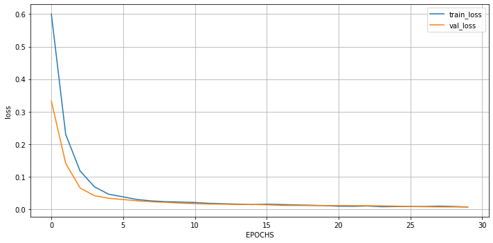
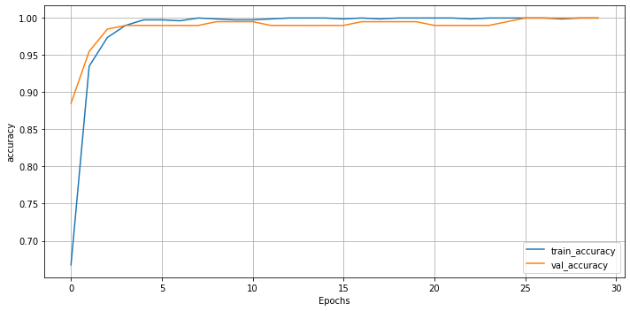

```python
!nvidia-smi
```

    Sun May 23 15:27:13 2021       
    +-----------------------------------------------------------------------------+
    | NVIDIA-SMI 465.19.01    Driver Version: 460.32.03    CUDA Version: 11.2     |
    |-------------------------------+----------------------+----------------------+
    | GPU  Name        Persistence-M| Bus-Id        Disp.A | Volatile Uncorr. ECC |
    | Fan  Temp  Perf  Pwr:Usage/Cap|         Memory-Usage | GPU-Util  Compute M. |
    |                               |                      |               MIG M. |
    |===============================+======================+======================|
    |   0  Tesla T4            Off  | 00000000:00:04.0 Off |                    0 |
    | N/A   64C    P8    11W /  70W |      0MiB / 15109MiB |      0%      Default |
    |                               |                      |                  N/A |
    +-------------------------------+----------------------+----------------------+
                                                                                   
    +-----------------------------------------------------------------------------+
    | Processes:                                                                  |
    |  GPU   GI   CI        PID   Type   Process name                  GPU Memory |
    |        ID   ID                                                   Usage      |
    |=============================================================================|
    |  No running processes found                                                 |
    +-----------------------------------------------------------------------------+
    


```python
import os
import numpy as np
import random
```


```python
%pwd
```


    '/content'


```python
# 작업 경로로 이동
%cd /content/drive/MyDrive/mask_detector
```

    /content/drive/MyDrive/mask_detector
    

# train, validation, test dataset 나누기


```python
# path 변수 생성
base_path = '/content/drive/MyDrive/mask_detector'
image_path = os.path.join(base_path, 'images')
model_path = os.path.join(base_path, 'models')

 # directory 경로
train_path = os.path.join(image_path, 'train')
validation_path = os.path.join(image_path, 'validation')
test_path = os.path.join(image_path, 'test')
```


```python
image_path
```


    '/content/drive/MyDrive/mask_detector/images'


```python
import random
import shutil

def split_move_image(data_path):
    # 필요한 directory 생성
    for temp in ['train', 'validation', 'test']:
        os.makedirs(os.path.join(image_path, temp, 'with_mask'), exist_ok=True)
        os.makedirs(os.path.join(image_path, temp, 'without_mask'), exist_ok=True)

    # directory안에 이미지 파일만 filtering하고 섞어준다.(마스크 3가지 색이 섞일 수 있도록)
    image_list = [fname for fname in os.listdir(data_path) if os.path.splitext(fname)[-1] == '.jpg']
    random.shuffle(image_list)

    # 현재 작업하는 이미지가 어떤 것인지
    img = image_list[0]
    classes = 'without_mask'
    if img.split('_')[0] == 'with':
        classes = 'with_mask'
    
    # 데이터 400, 100, 100으로 나누기
    for i, image in enumerate(image_list):
        if i < 400:
            shutil.move(os.path.join(image_path, image), os.path.join(train_path, classes, image))
        elif i < 500:
            shutil.move(os.path.join(image_path, image), os.path.join(validation_path, classes, image))
        else:
            shutil.move(os.path.join(image_path, image), os.path.join(test_path, classes, image))
```


```python
# 이미지 압축 풀기
!unzip -q without_mask600.zip -d /content/drive/MyDrive/mask_detector/images
```


```python
split_move_image(image_path, train_path, test_path, validation_path)
```


```python
!unzip -q with_mask600.zip -d /content/drive/MyDrive/mask_detector/images
```


```python
split_move_image(image_path, train_path, test_path, validation_path)
```

## pretrained model 불러와서 fine tuning

1. generator 생성
2. 모델 생성 및 컴파일
3. callback(modelcheckpoint) 정의, best model 경로 지정
4. 학습하기
5. history 시각화
6. evaluate


```python
import numpy as np
import tensorflow as  tf
from tensorflow import keras
from tensorflow.keras import layers
from tensorflow.keras.applications import MobileNetV2
from tensorflow.keras.preprocessing.image import ImageDataGenerator
```

#### 1. generator 생성


```python
N_BATCHS = 100
N_EPOCHS = 30
LEANRING_RATE = 0.0001

def get_generators():
    train_datagen = ImageDataGenerator(rescale=1/255,
                                       rotation_range=40,
                                       brightness_range=(0.7, 1.3),
                                       zoom_range=0.2,
                                       horizontal_flip=True)
    test_datagen = ImageDataGenerator(rescale=1/255) 
    # generator 생성
    train_generator = train_datagen.flow_from_directory(train_path,
                                                        target_size=(224, 224),
                                                        batch_size=N_BATCHS,
                                                        class_mode='binary')
    validation_generator = test_datagen.flow_from_directory(validation_path,
                                                            target_size=(224, 224),
                                                            batch_size=N_BATCHS,
                                                            class_mode='binary')
    test_generator = test_datagen.flow_from_directory(test_path,
                                                      target_size=(224, 224),
                                                      batch_size=N_BATCHS,
                                                      class_mode='binary')
    return train_generator, validation_generator, test_generator
```


```python
train_iterator, validation_iterator, test_iterator = get_generators()
```

    Found 800 images belonging to 2 classes.
    Found 200 images belonging to 2 classes.
    Found 207 images belonging to 2 classes.
    

#### 2. 모델 생성 및 컴파일


```python
# basemodel = MobileNetV2(include_top=False, weights='imagenet', input_tensor=keras.Input(shape=(224, 224, 3)))
# model = basemodel.output
# model = layers.GlobalAveragePooling2D()(model)
# model = layers.Dense(128)(model)
# model = layers.BatchNormalization()(model)
# model = layers.ReLU()(model)
# model = layers.Dropout(rate=0.5)(model)
# model = layers.Dense(2, activation='softmax')(model)

# model = Model(inputs=basemodel.input, outputs=model)
```


```python
basemodel = MobileNetV2(include_top=False, weights='imagenet', input_shape=(224, 224, 3))

model = keras.Sequential()
model.add(basemodel)
model.add(layers.GlobalAveragePooling2D())
model.add(layers.Dense(128))
model.add(layers.BatchNormalization())
model.add(layers.ReLU())
model.add(layers.Dropout(rate=0.5))

model.add(layers.Dense(2, activation='softmax'))
```


```python
model.compile(optimizer=keras.optimizers.Adam(learning_rate=LEANRING_RATE),
              loss='binary_crossentropy', metrics=['accuracy'],)
```


```python
model.summary()
```

    Model: "sequential_3"
    _________________________________________________________________
    Layer (type)                 Output Shape              Param #   
    =================================================================
    mobilenetv2_1.00_224 (Functi (None, 7, 7, 1280)        2257984   
    _________________________________________________________________
    global_average_pooling2d_3 ( (None, 1280)              0         
    _________________________________________________________________
    dense_6 (Dense)              (None, 128)               163968    
    _________________________________________________________________
    batch_normalization_3 (Batch (None, 128)               512       
    _________________________________________________________________
    re_lu_3 (ReLU)               (None, 128)               0         
    _________________________________________________________________
    dropout_3 (Dropout)          (None, 128)               0         
    _________________________________________________________________
    dense_7 (Dense)              (None, 1)                 129       
    =================================================================
    Total params: 2,422,593
    Trainable params: 2,388,225
    Non-trainable params: 34,368
    _________________________________________________________________
    

#### 3. callback 정의 및 최종 모델 저장할 경로 지정


```python
saved_model_path = os.path.join(model_path, 'saved_model_{epoch:02d}.ckpt')
```

#### 4. 학습


```python
history = model.fit(train_iterator,
                    epochs=N_EPOCHS,
                    steps_per_epoch=len(train_iterator),
                    validation_data=validation_iterator,
                    validation_steps=len(validation_iterator),
                    callbacks=[mc_callback])
```

    Epoch 1/30
    8/8 [==============================] - 23s 2s/step - loss: 0.7127 - accuracy: 0.5564 - val_loss: 0.3325 - val_accuracy: 0.8850
    Epoch 2/30
    8/8 [==============================] - 17s 2s/step - loss: 0.2737 - accuracy: 0.9096 - val_loss: 0.1408 - val_accuracy: 0.9550
    Epoch 3/30
    8/8 [==============================] - 17s 2s/step - loss: 0.1342 - accuracy: 0.9689 - val_loss: 0.0654 - val_accuracy: 0.9850
    Epoch 4/30
    8/8 [==============================] - 18s 2s/step - loss: 0.0733 - accuracy: 0.9895 - val_loss: 0.0416 - val_accuracy: 0.9900
    Epoch 5/30
    8/8 [==============================] - 17s 2s/step - loss: 0.0471 - accuracy: 0.9973 - val_loss: 0.0336 - val_accuracy: 0.9900
    Epoch 6/30
    8/8 [==============================] - 17s 2s/step - loss: 0.0408 - accuracy: 0.9959 - val_loss: 0.0298 - val_accuracy: 0.9900
    Epoch 7/30
    8/8 [==============================] - 17s 2s/step - loss: 0.0366 - accuracy: 0.9922 - val_loss: 0.0257 - val_accuracy: 0.9900
    Epoch 8/30
    8/8 [==============================] - 17s 2s/step - loss: 0.0265 - accuracy: 1.0000 - val_loss: 0.0228 - val_accuracy: 0.9900
    Epoch 9/30
    8/8 [==============================] - 17s 2s/step - loss: 0.0224 - accuracy: 0.9989 - val_loss: 0.0211 - val_accuracy: 0.9950
    Epoch 10/30
    8/8 [==============================] - 17s 2s/step - loss: 0.0231 - accuracy: 0.9960 - val_loss: 0.0187 - val_accuracy: 0.9950
    Epoch 11/30
    8/8 [==============================] - 17s 2s/step - loss: 0.0189 - accuracy: 0.9983 - val_loss: 0.0170 - val_accuracy: 0.9950
    Epoch 12/30
    8/8 [==============================] - 18s 2s/step - loss: 0.0189 - accuracy: 0.9968 - val_loss: 0.0160 - val_accuracy: 0.9900
    Epoch 13/30
    8/8 [==============================] - 17s 2s/step - loss: 0.0159 - accuracy: 1.0000 - val_loss: 0.0153 - val_accuracy: 0.9900
    Epoch 14/30
    8/8 [==============================] - 17s 2s/step - loss: 0.0168 - accuracy: 1.0000 - val_loss: 0.0144 - val_accuracy: 0.9900
    Epoch 15/30
    8/8 [==============================] - 18s 2s/step - loss: 0.0149 - accuracy: 1.0000 - val_loss: 0.0146 - val_accuracy: 0.9900
    Epoch 16/30
    8/8 [==============================] - 17s 2s/step - loss: 0.0133 - accuracy: 0.9997 - val_loss: 0.0136 - val_accuracy: 0.9900
    Epoch 17/30
    8/8 [==============================] - 18s 2s/step - loss: 0.0144 - accuracy: 1.0000 - val_loss: 0.0118 - val_accuracy: 0.9950
    Epoch 18/30
    8/8 [==============================] - 17s 2s/step - loss: 0.0117 - accuracy: 0.9994 - val_loss: 0.0115 - val_accuracy: 0.9950
    Epoch 19/30
    8/8 [==============================] - 18s 2s/step - loss: 0.0124 - accuracy: 1.0000 - val_loss: 0.0111 - val_accuracy: 0.9950
    Epoch 20/30
    8/8 [==============================] - 18s 2s/step - loss: 0.0112 - accuracy: 1.0000 - val_loss: 0.0110 - val_accuracy: 0.9950
    Epoch 21/30
    8/8 [==============================] - 18s 2s/step - loss: 0.0094 - accuracy: 1.0000 - val_loss: 0.0112 - val_accuracy: 0.9900
    Epoch 22/30
    8/8 [==============================] - 17s 2s/step - loss: 0.0089 - accuracy: 1.0000 - val_loss: 0.0109 - val_accuracy: 0.9900
    Epoch 23/30
    8/8 [==============================] - 18s 2s/step - loss: 0.0088 - accuracy: 0.9992 - val_loss: 0.0107 - val_accuracy: 0.9900
    Epoch 24/30
    8/8 [==============================] - 17s 2s/step - loss: 0.0073 - accuracy: 1.0000 - val_loss: 0.0101 - val_accuracy: 0.9900
    Epoch 25/30
    8/8 [==============================] - 18s 2s/step - loss: 0.0082 - accuracy: 1.0000 - val_loss: 0.0093 - val_accuracy: 0.9950
    Epoch 26/30
    8/8 [==============================] - 17s 2s/step - loss: 0.0074 - accuracy: 1.0000 - val_loss: 0.0083 - val_accuracy: 1.0000
    Epoch 27/30
    8/8 [==============================] - 17s 2s/step - loss: 0.0080 - accuracy: 1.0000 - val_loss: 0.0076 - val_accuracy: 1.0000
    Epoch 28/30
    8/8 [==============================] - 18s 2s/step - loss: 0.0092 - accuracy: 0.9994 - val_loss: 0.0071 - val_accuracy: 1.0000
    Epoch 29/30
    8/8 [==============================] - 17s 2s/step - loss: 0.0086 - accuracy: 1.0000 - val_loss: 0.0070 - val_accuracy: 1.0000
    Epoch 30/30
    8/8 [==============================] - 17s 2s/step - loss: 0.0070 - accuracy: 1.0000 - val_loss: 0.0068 - val_accuracy: 1.0000
    

#### 5. 결과 시각화


```python
import matplotlib.pyplot as plt

# loss 그래프 함수
def loss_plot(history, min_lim=None, max_lim=None):
    plt.figure(figsize=(10, 5))
    plt.plot(history['loss'], label='train_loss')
    plt.plot(history['val_loss'], label='val_loss')
    plt.xlabel('EPOCHS')
    plt.ylabel('loss')
    if min_lim and max_lim:
        plt.ylim(min_lim, max_lim)
    plt.tight_layout()
    plt.legend()
    plt.grid(True)
    plt.show()

# accuracy 그래프 함수
def acc_plot(history, min_lim=None, max_lim=None):
    plt.figure(figsize=(10, 5))
    plt.plot(history['accuracy'], label='train_accuracy')
    plt.plot(history['val_accuracy'], label='val_accuracy')
    plt.xlabel('Epochs')
    plt.ylabel('accuracy')
    if min_lim and max_lim:
        plt.ylim(min_lim, max_lim)
    plt.tight_layout()
    plt.legend()
    plt.grid(True)
    plt.show()
```


```python
loss_plot(history.history)
acc_plot(history.history)
```


    

    


    

    


#### 6. evaluation


```python
model.evaluate(test_iterator)
```

    3/3 [==============================] - 30s 15s/step - loss: 0.0155 - accuracy: 0.9903
    


    [0.015466252341866493, 0.990338146686554]


```python
# best model test set 확인

best_model_path = os.path.join(model_path, 'best_model.ckpt')

saved_model = keras.models.load_model(best_model_path)
```


```python
saved_model.evaluate(test_iterator)
```

    3/3 [==============================] - 32s 15s/step - loss: 0.0880 - accuracy: 0.9855
    


    [0.08797644078731537, 0.9855072498321533]


